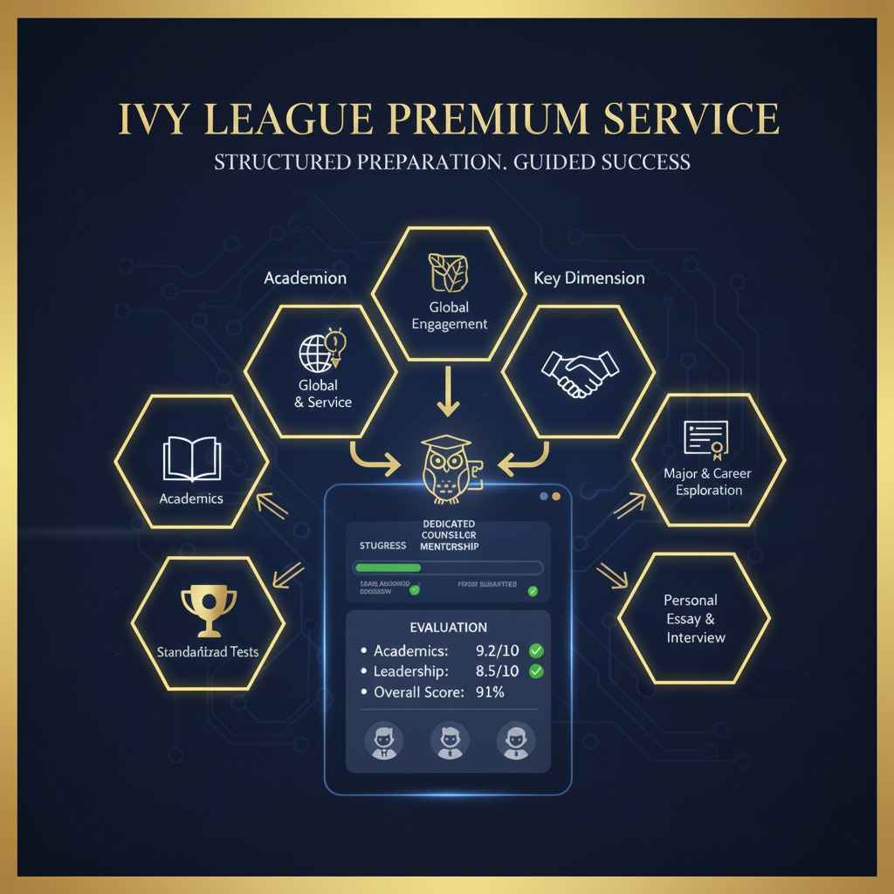

# Ivy League Premium Service

  

## 🎓 Overview
**Ivy League Premium Service** provides a sophisticated, structured preparation ecosystem designed for elite student mentorship. By combining agent-recommended task logic with dedicated counselor oversight, we ensure students excel across the six essential dimensions required for top-tier university admissions.

---

## 🏛️ The Six Pillars of Success
Our mentorship framework is built upon a holistic approach to student development:

* **Academics:** Rigorous curriculum planning and performance tracking.
* **Standardized Tests:** Strategic preparation for SAT, ACT, and AP exams.
* **Global Engagement:** Fostering social impact and international perspectives.
* **Major & Career Exploration:** Deep-diving into professional interests and research.
* **Personal Essay & Interview:** Crafting unique narratives and mastering communication.
* **Leadership & Profile:** Building a distinguished portfolio of extracurricular achievements.

---

## ⚙️ How It Works

### 1. Mentorship & Task Assignment
Counselors utilize an **agent-recommended engine** to assign high-impact tasks tailored to the student’s specific goals and timeline.

### 2. Verified Submissions
Students upload **verified proof** of their work (documents, certificates, or media). This creates a transparent audit trail of the student's progress.

### 3. Multi-Stakeholder Transparency
Progress is not a black box. Our platform provides real-time visibility for:
* **Students:** To track their growth and pending actions.
* **Parents:** To stay informed about their child's development milestones.
* **Staff:** To ensure quality control and consistent mentorship.

---

## 📊 Transparent Evaluation
We utilize a data-driven scoring model to ensure excellence:
* **Pointer-wise Scoring:** Detailed feedback on every specific task.
* **Overall Performance Index:** A weighted score reflecting total readiness.
* **Visual Dashboards:** Easy-to-read progress charts and dimension-wise heatmaps.

---

  <i>Empowering the next generation of global leaders through structured excellence.</i>

